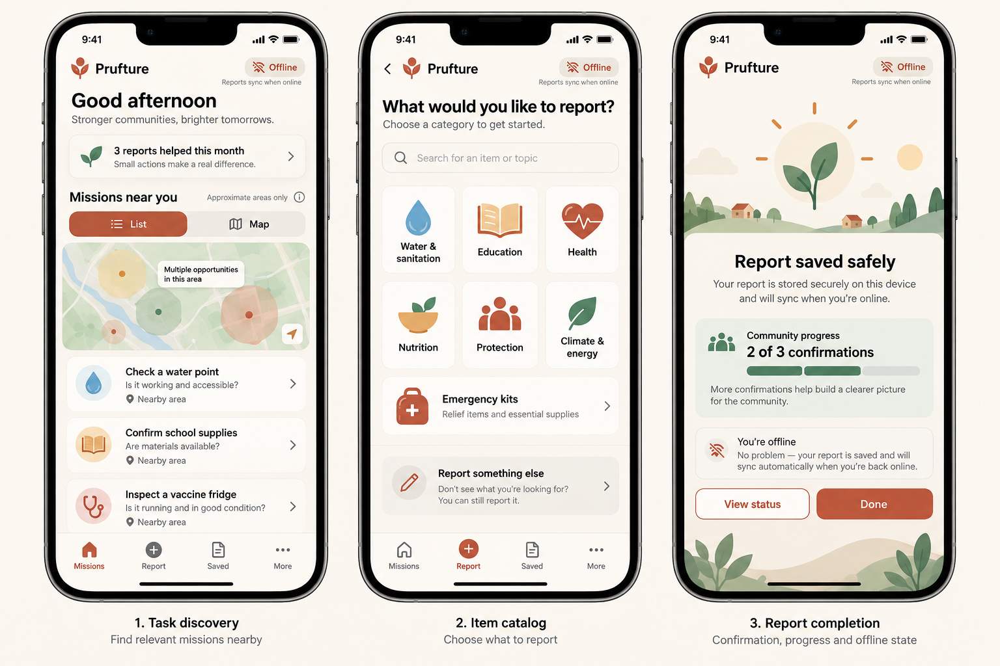
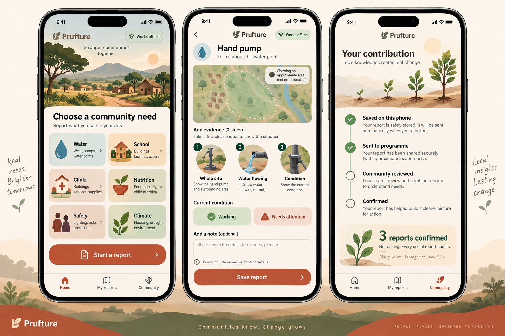

<!-- speedrun-2-ui-ux-audit.md: evidence-based product audit of the second Prufture device run.
     It separates current main, unmerged work, and proposed UX so concepts are never mistaken for
     implemented behavior. Primary sources and visual directions are included for later review. -->

# Speedrun 2 UI/UX and product audit

Date: 2026-09-28

Evidence: `apps/speedrun-prufture-2.mp4` (2:36, 1290 × 2796, 60 fps), current source, and
`feat/field-catalog-maps` at `5127f74`.

## Executive verdict

**The prototype meets the proof-at-capture technical spine, but it does not yet meet the product
plan as a credible general-purpose field app.** The speedrun proves that a reporter can open an
assignment, capture several photos, answer closed questions, obtain a coarse area, review, save,
and inspect a public record. It also exposes the main product gap: the journey feels authored for
one demo assignment — solar panels and classroom lights — instead of a reusable community evidence
tool.

The current `main` experience has no reporter map, only three hardcoded assignments, hardcoded area
labels, and no user-selectable item catalog. A separate unmerged branch already addresses part of
this gap with 13 item types, self-started reports, coarse-area maps, five example assignments,
distance ordering, and location detection. That branch is a useful foundation, not a production
data system: its assignments and cells remain static examples.

## What the speedrun demonstrates

### Working and aligned with the plan

- The assignment intro is short, tells the reporter what evidence is needed, and keeps one clear
  primary action.
- Camera and location permissions are explained before use.
- Multi-photo capture works and the camera prompt changes by evidence step.
- Questions use large, closed choices instead of fragile free-form forms.
- Review shows photos, answers, approximate area, and privacy language before submission.
- The report can be saved locally and later shown as sent/reviewed/confirmed.
- Public verification exposes an approximate area and public reference without reporter identity.
- Reporter settings include offline storage, privacy, haptics, and controllable celebrations.

### Product and UX gaps observed

| Gap | Evidence | Impact | Priority |
|---|---|---|---|
| Demo-specific scope | Every completed capture is solar panels, equipment labels, or lights. | Users cannot understand that Prufture covers broader community work. | P0 |
| No self-started item flow on `main` | Tasks contains three assignment cards only. | A reporter standing by a broken pump or delivered kit has no suitable entry. | P0 |
| No reporter map on `main` | Task discovery is list-only. | “Near you” is asserted without spatial evidence or meaningful orientation. | P0 |
| Static assignments and areas | `src/tasks.ts` contains Kalama, Turkana West, and Garissa literals. | It looks dynamic but is demo data; there is no programme feed or cached assignment API. | P0 |
| Weak home/task differentiation | Home, Tasks, and the report button compete to start the same journey. | Navigation costs attention without adding capability. | P1 |
| Capture progress is functional but emotionally flat | Three photo prompts are nearly identical full-screen camera states. | Long capture sequences feel repetitive and make mistakes harder to notice. | P1 |
| Celebration arrives only at the end | Completion is a checkmark plus copy. | The app misses calm reinforcement during useful milestones. | P1 |
| Public verification leaves the product context | The speedrun opens a dark browser and then Blockscout. | This validates the chain, but it is too technical for the reporter journey. | P1 |
| No safe optional context | Closed questions cannot explain a broken part or partial delivery. | Programme teams lose useful field context. | P1 |
| Contribution summary is not actionable | “31 reports confirmed” is positive but disconnected from categories or outcomes. | It can feel like a vanity counter rather than meaningful feedback. | P2 |

## Implementation truth table

| Capability | Current `main` | `feat/field-catalog-maps` | Still required |
|---|---|---|---|
| Offline capture, sign, queue | Implemented | Preserved | Device regression pass |
| Assigned tasks | Three static tasks | Five static example assignments | Programme API + cached envelope |
| Item catalog | Missing | 13 items / 6 categories | Review, expand, localize |
| Start an unassigned report | Missing | Implemented with `item:<itemId>` | Pilot validation |
| Reporter location | Captured during report | Approximate area also used for discovery | Permission timing and location naming |
| Reporter map | Missing | Coarse cells and fallback | Remove exact-centre pins; use area shapes only |
| Nearest sorting | Missing | Haversine distance between cell centres | Honest “approximate” labels |
| Optional notes | Missing | Missing | Add privacy-safe local draft field |
| Dynamic assignments | Missing | Missing | Typed API, timeout, cache, offline fallback |
| Calm gamification | Basic celebration toggle and total | Same | Collective progress and milestone motion |

## Research findings

U-Report describes itself as a **free, anonymous and safe** way for young people to share views,
receive trusted information, and drive change. Its current content spans climate action, conflict
safety, online life, vaccines, child rights, education, accessibility, and community action. This
supports a broad category model, but not a claim that U-Report currently assigns physical
verification jobs. Prufture should be positioned as a proof-at-capture extension concept, not as an
existing U-Report feature.

UNICEF Supply Division's current public structure consistently groups work into education, health
technologies and medicines, nutrition, vaccines/cold chain, WASH, pre-packed kits, construction,
emergencies, and sustainability. The 2024 supply results make several field-verifiable categories
especially credible: vaccine cold chain and solar systems, RUTF, school/learning construction,
insecticide-treated nets, cholera diagnostics, medical equipment, water, hygiene kits, and
emergency supplies. UNICEF's kit documentation also names School-in-a-Box, ECD and recreation kits,
health kits, and WASH/dignity kits.

Primary sources:

- [U-Report — Your voice matters](https://www.u-report.org/)
- [UNICEF Supply Annual Report 2024](https://www.unicef.org/supply/reports/unicef-supply-annual-report-2024)
- [UNICEF pre-packed kits](https://www.unicef.org/supply/unicefs-pre-packed-kits)
- [UNICEF WASH and Dignity Kit](https://www.unicef.org/supply/unicefs-wash-and-dignity-kit)
- [UNICEF Supply products and services](https://www.unicef.org/supply/what-we-do)
- [UNICEF supply data and transparency](https://www.unicef.org/supply/data-and-transparency)

## Recommended catalog

The catalog should describe **observable assets or completed work**, not sensitive cases, people,
medical diagnoses, or entitlements. Each item should define 1–3 photos, 1–2 closed questions, a
privacy warning, and a safe “could not confirm” response.

| Category | Pilot items | What can be safely verified |
|---|---|---|
| Water and sanitation | Hand pump/water point; tap stand; toilet/latrine block; handwashing station; water tank/storage; WASH kit | Present/absent, water flowing, visible condition, soap/water available, packaging/count |
| Education | Classroom built/repaired; school solar/lighting; School-in-a-Box; ECD kit; recreation kit; desks/learning materials | Completion, visible condition, kit present, lights working, materials available |
| Health | Vaccine fridge/cold-chain unit; clinic/health post repair; solar system; oxygen equipment; bed nets; emergency health kit | Installed/present, power/status display, visible condition, packaging/count; never patient data |
| Nutrition | RUTF stock; MUAC tapes; nutrition kit; dry storage area | Stock present/low/absent, sealed packaging, dry/off-floor storage; never photograph recipients |
| Protection and dignity | Child-friendly space; adolescent kit; dignity kit; safety lighting; accessible path/ramp | Space open, kit present, lights working, access unobstructed; no children or survivor information |
| Climate and energy | Tree-planting site; solar street light; flood/storm damage; drainage; resilient school repair | Visible completion/damage, current condition, broad count bands, safe access |
| Emergency response | Family hygiene kit; water container/jerrycan; tarpaulin/tent; relief distribution point | Visible stock or installation, packaging, condition; no beneficiary faces or distribution lists |

### Catalog items to exclude from self-started reporting

- Vaccination status, diagnoses, treatment, or any patient-specific observation.
- Child protection incidents, violence, exploitation, or names of survivors.
- Household eligibility, benefit entitlement, or identity documents.
- Exact home locations, exact school/clinic coordinates, or faces without explicit consent.
- Medicine quality judgements that require trained inspection.

These need dedicated safeguarding and referral flows, not a generic evidence card.

## Location and map model

1. **Assigned work:** the programme sends `taskId`, `itemId`, a human-readable approximate area,
   and a coarse 5-character geohash. It must not send an exact public point.
2. **Self-started work:** the phone detects a coarse cell when the reporter begins the report. No
   place name is hardcoded.
3. **Map:** render translucent coarse-area polygons. Do not place a marker at the cell centre; a
   centre marker visually implies false precision.
4. **Offline:** cache assignments and the item catalog. Replace map tiles with a simple ordered list
   and “Map available when online”; reporting remains available.
5. **Language:** say “Approximate area”, “Near this area”, and “About 12 km away”, never “exact
   location” or a street address.

The map on the unmerged branch is directionally correct, but its `Marker` at each cell centre should
be removed before shipping. The polygon itself is the honest spatial representation.

## Optional notes

Add one optional field after closed questions, not before them:

- Label: **“Add a note (optional)”**
- Helper: **“Share useful details. Do not include names, phone numbers, ID numbers, or exact
  addresses.”**
- Maximum: 280 characters, with a visible remaining count after 200.
- Storage: local draft/evidence bundle only by default; never part of the public/on-chain payload.
- Review: shown under “Additional context” with an Edit action.
- Failure behavior: trimming/validation is local and never prevents saving the core report.

## UI direction

### Recommended hybrid

Use **Direction A for discovery** and **Direction B for capture, notes, and contribution feedback**.
Direction A makes assigned and self-started work legible. Direction B feels more human and turns
progress into collective growth without manipulating the reporter.

#### Direction A — Missions near you

Strengths: spatial orientation, clear catalog breadth, assigned task hierarchy, compact completion
state. Risk: the map can dominate on low-end phones; default to List and remember the user's view.

#### Direction B — Community journey

Strengths: strongest category comprehension, best evidence checklist, safe notes, meaningful
non-competitive progress. Risk: illustrations must stay light so the interface remains fast offline.

## Motion and gamification

Gamification must reinforce truthful contribution, not volume.

| Moment | Motion | Feedback |
|---|---|---|
| Category selected | 140–180 ms spring scale and tinted icon fill | Light haptic |
| Task opened | Checklist rows reveal in a 40 ms stagger | “About 2 min · works offline” |
| Photo captured | Brief shutter ring, thumbnail settles into its numbered slot | Medium haptic; no confetti |
| Evidence step complete | Progress line grows to next step | Short success haptic |
| Saved offline | Small terracotta dot travels into a phone/storage icon | “Saved safely on this phone” |
| Sync completes | Dot moves from phone to programme icon | Non-blocking banner |
| Community confirmation | One leaf grows on the contribution plant | Optional restrained particles |
| Category milestone | A category ring fills from confirmed reports only | “3 water reports confirmed” |

Guardrails:

- No leaderboard, streak loss, points, badges for raw submission count, money, or scarcity timer.
- Do not reward duplicates or claims that are not confirmed.
- Celebrations remain user-controllable and respect reduced motion.
- Never say a report “helped” unless there is a real programme acknowledgement; otherwise say
  “confirmed” or “reviewed”.

## Navigation proposal

Replace five equal tabs with four destinations:

1. **Home** — nearest assignments, offline state, one “Start a report” action.
2. **Explore** — List/Map plus full item catalog.
3. **My reports** — saved, sent, reviewed, confirmed timeline.
4. **Me** — privacy, accessibility, language, support, contribution summary.

The central report button can remain as a floating shortcut, but it should open the item picker; it
must not silently default to solar panels.

## Implementation slices

### Slice 1 — honest breadth (P0)

- Rebase the useful catalog work from `feat/field-catalog-maps` onto current `main` instead of
  merging the branch wholesale; its base also removes unrelated current backend work.
- Keep the item model and self-started `item:<itemId>` IDs.
- Expand the catalog to the reviewed pilot set, with tests for search/category/privacy hints.
- Remove map centre markers and retain coarse polygons.
- Add the optional notes field to the draft and review screen; keep it local/private.

### Slice 2 — real assignments (P0)

- Add a typed `/assignments` client behind an interface with timeout and typed degradation.
- Cache the last successful assignments in SQLite and ship only neutral demo fixtures in development.
- Render a visible “Example tasks” label whenever fixtures are active.
- Keep self-started reporting available when the service is unavailable.

### Slice 3 — experience and motion (P1)

- Consolidate Home/Tasks into Home + Explore.
- Add evidence checklist thumbnails and the milestone motion table above.
- Replace the vanity total with category confirmation summaries.
- Add reduced-motion tests and one device animation pass.

## Audit decision

**Recommendation: GO with changes.** The technical core is credible. Do not present the current
build as a complete field app until Slice 1 removes the solar-only demo impression. Do not present
locations or assignments as live until Slice 2 exists. The unmerged branch materially reduces the
gap, but it needs a clean rebase, map-precision correction, expanded catalog review, and explicit
example-data labeling before integration.
